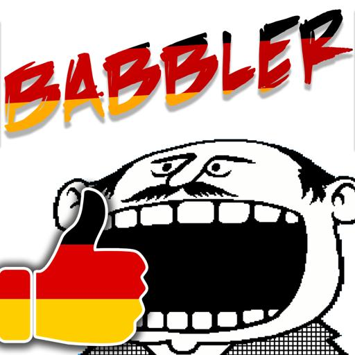
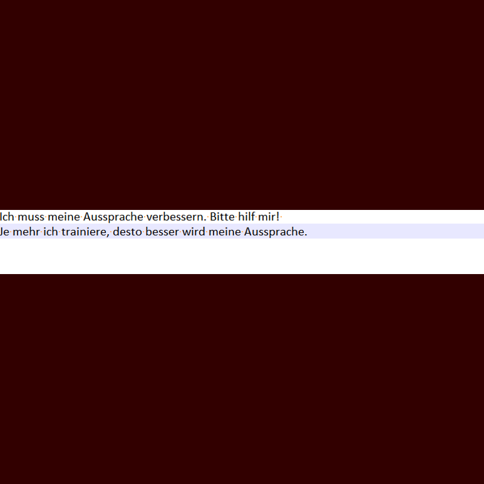
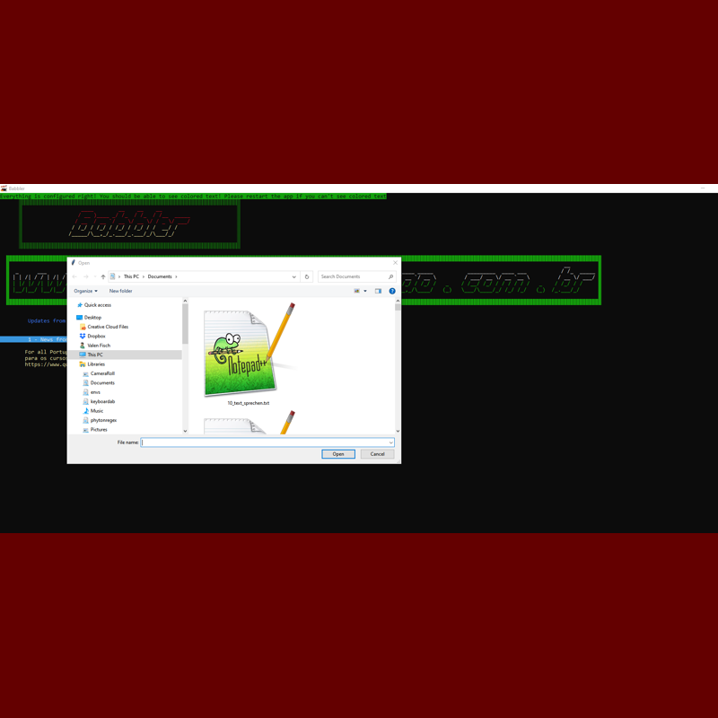
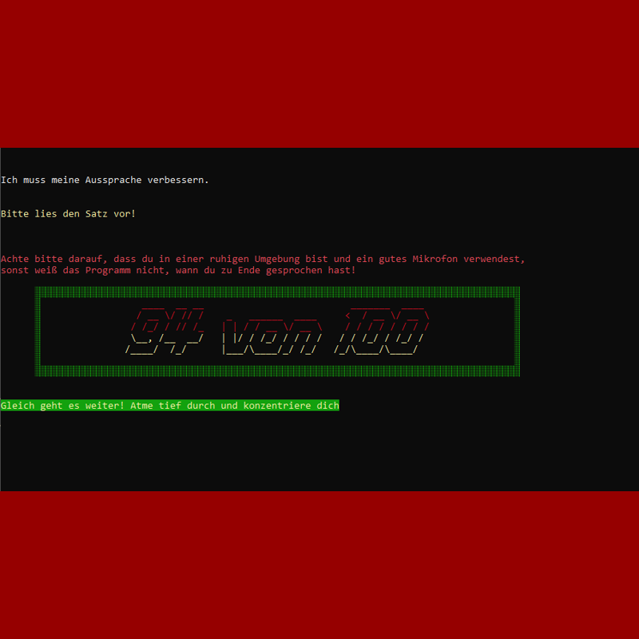
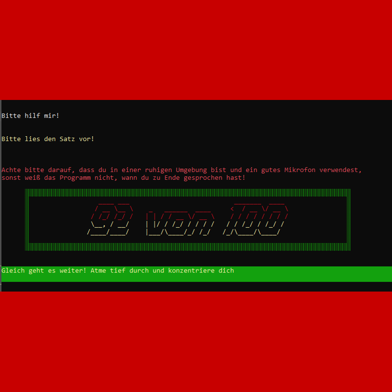

<p align="center"><a href="https://twitter.com/Aprender_alemao"></a><a href="https://www.facebook.com/estudaralemao/"></a><a href="https://www.instagram.com/estudaralemao/"></a><a href="https://www.youtube.com/c/wwwqueroestudaralemaocombr"></a><a href="https://api.whatsapp.com/send?phone=5511989782756&text=I%20want%20to%20know%20..."></a><a href="https://www.queroestudaralemao.com.br"></a><a href="https://br.pinterest.com/chucrutehans/"></a><a href="mailto:aulasparticularesdealemaosp@gmail.com?subject=I%20want%20to%20know%20...%20">
</a>

<a href="https://www.queroestudaralemao.com.br"></a></p>

<p align="center">
<a href=https://github.com/hansalemaos></a>
<a href=https://www.queroestudaralemao.com.br></a>
<a href=#></a>
<a href=#></a>
<a href=#></a>
<a href=https://codeload.github.com/liangjingkanji/DrakeTyporaTheme/zip/refs/heads/master></a>
<a href=https://github.com/dmhendricks/signature-social-icons></a>
</p><br>


# Babbler [DOWNLOAD THE INSTALLER HERE](https://www.dropbox.com/s/wk3ygmy7nj9lmif/Babbler_setup.exe?dl=0)


## What can you do with it?

- Practice your German pronunciation
- Google speech to text engine
- Works with any German text
- No coding required!
- Download,install and start
- Source code included!
- For Windows!

## How to install/run?

### Tutorial and things you have to know:

| _,.-'``'-.,_,.'`` Step 1 ``'.,_,.-'``'-.,_|Screenshot|
| -------------------------------------------------------------- |- |
Copy any text from a site, book or whatever and put it inside a<br>txt/docx/pdf/epub/pptx file, and save it.| |

| _,.-'``'-.,_,.'`` Step 2 ``'.,_,.-'``'-.,_|Screenshot|
| -------------------------------------------------------------- |- |
Start the app Babbler and make sure that you are in a quiet<br>environment! That is very important because if you are not in a quite environment, the<br>app will not know when to stop the audio recording. When I tested the app,<br>I had to turn off my air conditioner or had to use a denoiser app like Krisp<br>to make it work!| |

| _,.-'``'-.,_,.'`` Step 3 ``'.,_,.-'``'-.,_|Screenshot|
| -------------------------------------------------------------- |- |
Babbler will split the text into sentences and will ask you to say<br>each sentence. After you have said it, it will show you your grade.| |

| _,.-'``'-.,_,.'`` Step 4 ``'.,_,.-'``'-.,_|Screenshot|
| -------------------------------------------------------------- |- |
Do not worry if you do not get 100 points. I am a native speaker, and<br>I usually get between 90 and 98.| |


## License

```
GNU AFFERO GENERAL PUBLIC LICENSE
```

## Donations 

If this project has helped you somehow, consider donating a small amount. After being absent from computer programming for more than 20 years, I started again this year. At the beginning of 2021, I suffered from a bone infection and had to spend more than 3 months in hospital (only laying in bed!). To kill time, I stared learning Python, which rapidly became something bigger for me than just a "time killer".
[](https://www.paypal.com/donate/?hosted_button_id=TXH4HS4M54VV2)

